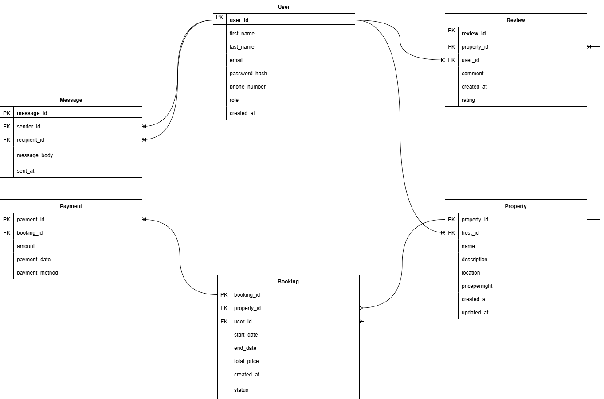

# Entity-Relationship (ER) Diagram

This section includes the Entity-Relationship (ER) diagram that visually represents the database schema used in the `alx-airbnb-database` project. The diagram illustrates the relationships between core entities "User", "Message", "Payment", "Booking", "Property", "Review", and how they interact in the relational model.

## 📊 ER Diagram

> 📝 The image above is generated using [draw.io](https://draw.io). 
